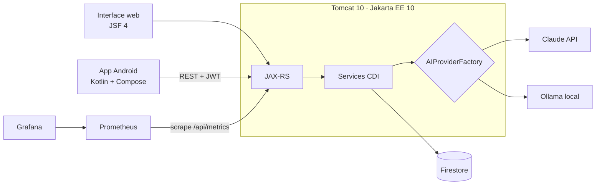

# InterviewAI

> Simulateur d'entretiens d'embauche assisté par IA. L'IA génère les questions selon le type d'entretien et le niveau, évalue la réponse (écrite ou orale) sur plusieurs critères, puis rend un feedback détaillé avec une réponse modèle. Disponible sur le web et sur Android.


<!-- Captures : ajouter docs/screenshots/web-session.png et docs/screenshots/android.png puis décommenter
<p align="center">
  
  
</p>
-->

Projet de fin d'année (PFA), ENSIAS, 2026.

## Fonctionnalités

**Entraînement**
- Sessions configurables : type d'entretien (**technique**, **RH**, **métier**) et niveau (**junior**, **confirmé**, **senior**)
- Questions générées par l'IA pour le poste visé
- Réponse au clavier ou **à la voix** (reconnaissance vocale sur Android), avec un minuteur par question
- **Évaluation multicritère** de chaque réponse : pertinence, clarté, profondeur, vocabulaire, exemples, puis note globale, points forts, axes d'amélioration, conseils concrets et réponse modèle
- **Difficulté adaptative** : l'IA recommande le niveau de la question suivante
- **Analyse de CV** : import d'un PDF, extraction du texte (PDFBox) et retour de l'IA

**Suivi**
- Historique détaillé des sessions, graphiques de progression, profil utilisateur

**Administration**
- Tableau de bord global, gestion des utilisateurs (création, modification, promotion ou rétrogradation, suppression) et des sessions

**Côté ingénierie**
- **Fournisseur d'IA interchangeable** (patterns Strategy et Factory) : Claude (API Anthropic) ou **Ollama en local** (`mistral:7b`), au choix par variable d'environnement
- **Endpoint de benchmark** qui compare côte à côte la latence et les réponses des deux fournisseurs
- **Observabilité** : métriques au format Prometheus et dashboard Grafana de performance de l'IA provisionné automatiquement
- **Une seule API REST sécurisée par JWT**, partagée par le web et le mobile

## Architecture



## Stack technique

| Partie | Technologies |
|---|---|
| Backend (`backend/`) | Java 21, Jakarta EE 10 (JAX-RS/Jersey, CDI/Weld, JSF 4, Bean Validation), Tomcat 10, Firebase Admin (Firestore), JJWT, Apache PDFBox, Prometheus simpleclient, JUnit 5, Maven |
| IA | Claude (API Anthropic) ou Ollama (`mistral:7b`), derrière une interface `AIProvider` commune |
| Mobile (`android/`) | Kotlin, Jetpack Compose, MVVM, Hilt, Retrofit + OkHttp, Navigation Compose, DataStore, graphiques Vico, `SpeechRecognizer` |
| Infra | Docker (build multi-stage), Docker Compose : application, Ollama, Prometheus, Grafana |

## Démarrage rapide

**Prérequis** : Docker, et un projet Firebase avec Firestore activé.

```bash
git clone https://github.com/MaestroAiman/interview-ai.git
cd interview-ai/backend
cp .env.example .env    # renseigner ANTHROPIC_API_KEY et JWT_SECRET (openssl rand -base64 64)
# placer la clé de service Firebase dans src/main/resources/firebase-service-account.json
docker compose up --build
```

| Service | URL |
|---|---|
| Application web | http://localhost:8080/interview-ai |
| Prometheus | http://localhost:9090 |
| Grafana | http://localhost:3000 |

Pour n'utiliser que l'IA locale, passer `AI_PROVIDER` à `ollama` dans `docker-compose.yml`. Le modèle `mistral:7b` (~4 Go) est téléchargé au premier lancement. Guide détaillé : [backend/README-DOCKER.md](backend/README-DOCKER.md).

**Application Android** : ouvrir `android/` dans Android Studio, ajouter le fichier `app/google-services.json` de votre projet Firebase, puis lancer sur un émulateur. L'API est attendue sur `http://10.0.2.2:8080/interview-ai/api/` (l'adresse de l'hôte vue depuis l'émulateur).

## Structure du dépôt

```
interview-ai/
├── backend/
│   ├── src/main/java/com/pfa/interviewai/
│   │   ├── rest/        # contrôleurs JAX-RS + DTO
│   │   ├── service/     # logique métier, fournisseurs d'IA
│   │   ├── repository/  # accès Firestore
│   │   ├── security/    # JWT, filtre d'authentification
│   │   ├── metrics/     # métriques Prometheus
│   │   └── bean/        # managed beans JSF
│   ├── src/main/webapp/ # pages JSF (.xhtml)
│   └── monitoring/      # config Prometheus + dashboards Grafana
└── android/
    └── app/src/main/java/com/pfa/interview/
        ├── data/        # repositories, client Retrofit
        └── ui/          # écrans Compose + ViewModels (session, résultats, historique, admin…)
```

---

Réalisé par [**Aiman**](https://github.com/MaestroAiman), élève ingénieur Data Science & Software Engineering à l'ENSIAS.
